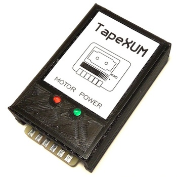

# TapeXUM
TapeXUM is a USB device that can read and write to cassettes of Commodore 16/64/VIC-20 (read and write) and ZX Spectrum (read only) format. It requires a Commodore datasette connected to it. This project is based on ZoomTape by Arnd Menge, a great idea and originally a part of OpenCBM package. TapeXUM uses Arduino Pro Micro and through hole components so it's a DIY friendly design.  
Huge thanks to Data/Tropyx for creating enclosure design for 3D printing!  

### Changes in software (since ZoomTape)
- modified device firmware to support Arduino Pro Micro
- added ability to continue tape capture even if stopped (before that, read was interrupted once datasette playback had stopped i.e. with Stop button)
- added azimuth adjustment feature (prepare your screwdriver)

### BOM
| Component  | qty |
| ------------- | ------------- |
| Arduino Pro Micro 5V | 1 |
| 1/4W Resistor for LEDs (~1K, depending on your preference) | 2 |
| 1/4W 1K Resistor | 1 |
| 1/2W 1.5k Resistor | 1 |
| 2N3904 Transistor | 1 |
| 2SD880 or 2SD313 Transistor | 1 |
| 3mm LED (i.e. green and red) | 2 |
| 6V8 Zener diode | 1 |
| 1N400x diode | 1 |
| 1uF electrolytic capacitor | 1 |
| 0.1uF electrolytic capacitor | 1 |
| Barrel jack DC connector 2.1/5.5mm or 2.5/5.5mm | 1 |
| 1x3 pin header 2.54mm and a jumper | 1 |
| 9VDC 500mA power supply with DC connector (center positive) | 1 |
| Micro USB cable | 1 |

### Download
Windows 7/10 64-bit libraries and tools: https://github.com/r1me/TapeXUM/releases/download/1.0/xum-installer-x64.zip  
Get PCB's from PCBWay: https://www.pcbway.com/project/shareproject/TapeXUM___Capture_and_write_Commodore_tapes_via_USB_device.html   
Gerber and Kicad files (hardware design): https://github.com/r1me/TapeXUM/tree/main/hardware  
Firmware for Arduino Pro Micro: https://github.com/r1me/TapeXUM/tree/main/firmware  
3D enclosure: https://www.thingiverse.com/thing:4659235  
OpenCBM: https://github.com/r1me/OpenCBM  

### Programming Arduino
`avrdude -p m32u4 -c avr109 -P comX -U flash:w:xum1541-PROMICRO_TAPE-v08.hex`

### License
TapeXUM follows same license for software as OpenCBM. PCB design of TapeXUM is free and shared under CERN OHW v2 (open hardware licence).
